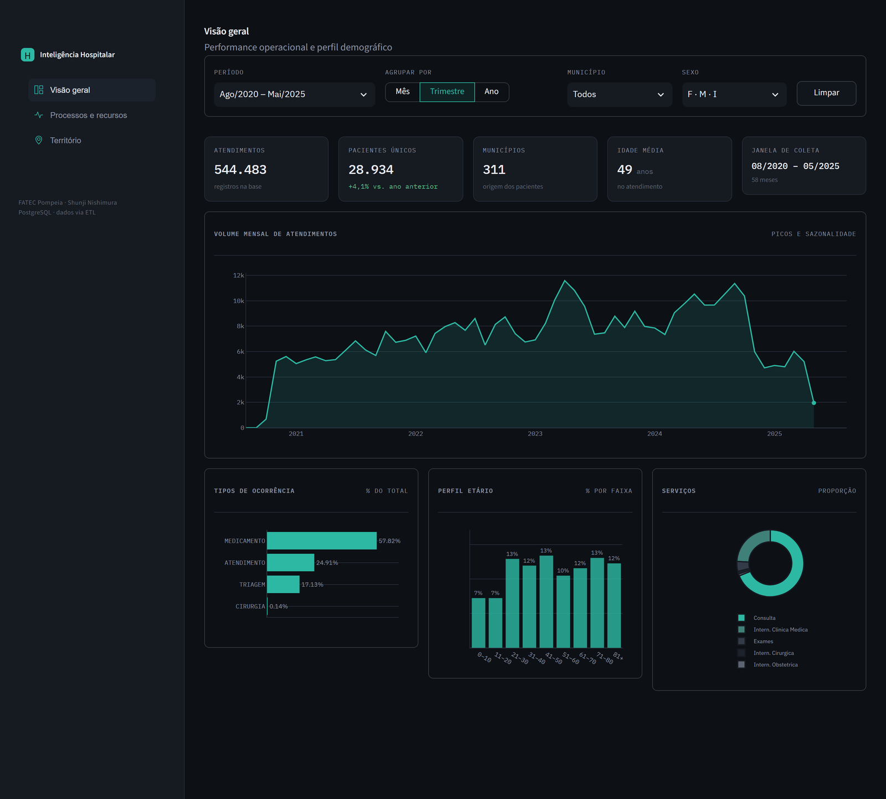
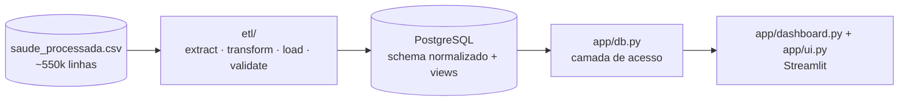
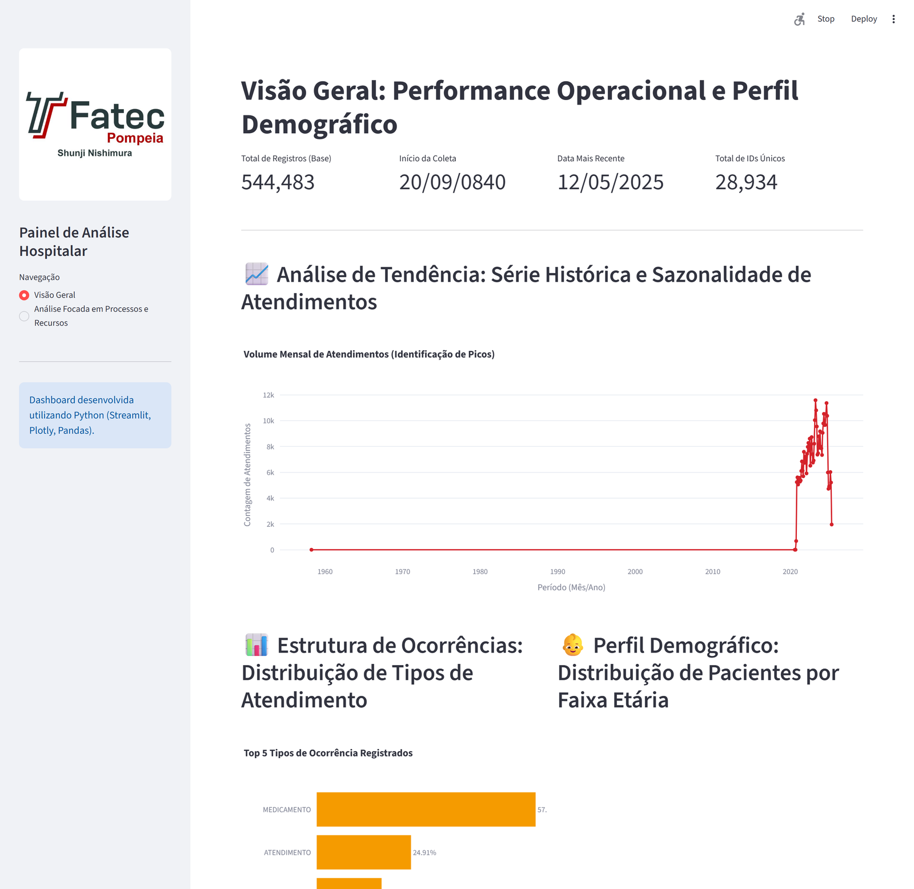

# Painel de Inteligência Hospitalar

Dashboard em Python para análise operacional, demográfica e territorial de
atendimentos hospitalares. Uma base bruta de ~550 mil registros é transformada
por um pipeline ETL num banco **PostgreSQL** normalizado, que alimenta o painel
em **Streamlit**.



## O que o painel mostra

| Seção | Conteúdo |
|---|---|
| **Visão geral** | Volume mensal (série histórica e sazonalidade), tipos de ocorrência, perfil etário, proporção de serviços |
| **Processos e recursos** | Medicamentos mais utilizados; nuvem de termos de queixas e diagnósticos |
| **Território** | Demanda por bairro e por município de origem do paciente |

## Arquitetura



Responsabilidades separadas: `app/settings.py` (configuração por variável de
ambiente), `app/db.py` (acesso a dados — só lê as views), `app/ui.py` (tema,
CSS e helpers de gráfico), `app/dashboard.py` (composição das telas).

## Como rodar

### Docker Compose

```bash
cp .env.example .env
docker compose up -d db          # PostgreSQL
docker compose run --rm etl      # constrói o banco a partir do CSV
docker compose up app            # http://localhost:8501
```

### Local

```bash
python -m venv .venv && . .venv/Scripts/activate     # ou: source .venv/bin/activate
pip install -r requirements.txt
cp .env.example .env
docker compose up -d db
python -m etl.run_etl
streamlit run app/dashboard.py
```

## Estrutura

```
data/          saude_processada.csv        fonte (imutável)
etl/           extract → transform → load → validate → run_etl
db/            schema.sql · views.sql      DDL versionado
app/           settings · db · ui · dashboard
docker/        Dockerfile
compose.yaml
```

## Stack

Python · PostgreSQL 16 · SQLAlchemy + pg8000 · pandas · Streamlit · Plotly ·
Docker Compose

## Da v1 à v2

A v1 foi meu primeiro projeto na faculdade (Tecnologia em Sistemas
Inteligentes). A v2 é uma reconstrução com foco em arquitetura e
reprodutibilidade.

| Antes — v1 | Depois — v2 |
|---|---|
| Script único (~300 linhas), dados e interface no mesmo arquivo | Camadas: ETL, acesso a dados, configuração, apresentação |
| Lê um CSV de ~100 MB a cada execução | PostgreSQL normalizado, com índices e views |
| `pip install` dentro do `import` | `requirements.txt` + Docker Compose |
| Idade calculada linha a linha (`.apply` em 550k linhas) | Cálculo vetorizado / em SQL |
| Sem validação — data inválida quebrava o gráfico | Limpeza no ETL + checagens que travam a carga |
| Parâmetros fixos no meio da lógica | `app/settings.py` por variável de ambiente |

<table>
  <tr>
    <td width="50%"><br><sub><b>v1</b> — versão original</sub></td>
    <td width="50%"><br><sub><b>v2</b> — reconstrução</sub></td>
  </tr>
</table>

O código da v1 permanece no histórico do repositório. Desenvolvimento conduzido
com abordagem *spec-driven* — especificação antes da implementação.
